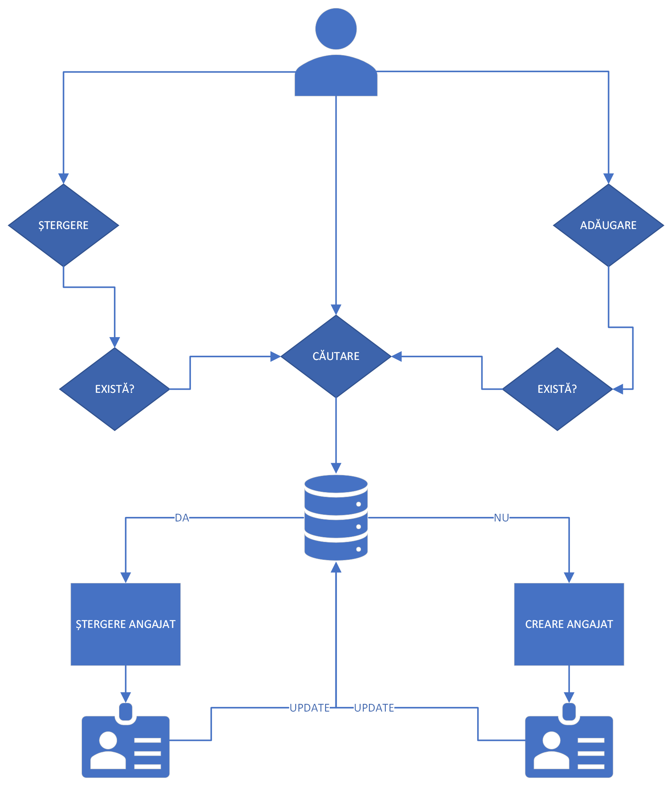
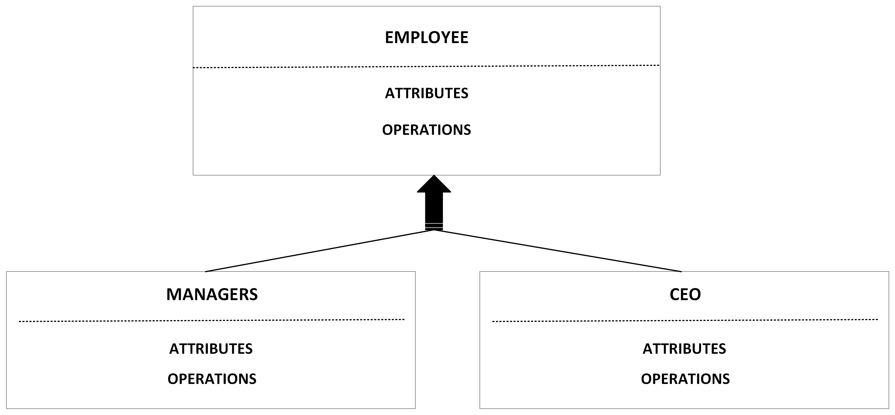

# jEmployees
### Rareș-Bogdan Ștefea

## Motivație

&nbsp;Multe companii au sisteme de gestionare a angajaților ineficiente și vechi precum dosarele ținute în depozite ce ocupa spațiu, se pot pierde ușor și ocupă mult timp până se găsesc informațiile căutate.
Aplicația propune un sistem performant, modern și ușor de implementat de evidență pentru angajații companiei cu metode intuitive de afișare și modificare care nu necesită pregătire anterioară pentru angajații ce vor opera aplicația.
De asemenea, se poate mula pe cerințele oricărei companii datele legate de angajați fiind ușor de înlocuit, eliminat sau adăugat.

## Descriere

&nbsp;Aplicația reprezintă un sistem de gestionare a datelor angajaților dintr-o companie.
Aplicația permite adăugarea, ștergerea și modificarea datelor de contact și datelor personale ale unui angajat.
De asemenea, aplicația permite căutarea angajaților în funcție de: CNP, numărul de angajat, număr de telefon, nume sau permite vizualizarea întregii liste de angajați în funcție de diferite filtre predefinite și crearea diferitelor funcții.

 <b>Date personale:</b>

 
  <ul>
<li> Nume întreg </li>
<li> Vârsta </li>
<li> CNP </li>
<li>Locul nașterii</li>
<li>Stare civilă</li>
<li> Naționalitate </li>
<li> Departamentul în care este angajat </li>
<li> Salariul lunar </li>
<li>Cod identificaren angajat</li>
<li>Funcție</li>
    </ul>

<b>Date de contact:</b>

 
<li>Număr de telefon</li>
<li>Adresa actuală</li>
<li>Email</li> 

## Obiective

* Utilizarea, familiarizarea și integrarea conceptelor de **OOP**(object oriented programming) într-un proiect informatic realizat în limbajul **Java**.
* Utilizarea și crearea **bazelor de date** cu scopul integrării acestora într-un proiect informatic realizat în limbajul **Java**.
  - Modificarea bazelor de date pentru a asigura **longetivitatea acestora**.
   - Crearea metodelor pentru asigurarea interogărilor **eficiente** in bazele de date.
* Realizarea unei interfețe grafice intuitive pentru utilizatori.
* Crearea unei aplicații eficiente pentru crearea și căutarea obiectelor la un volum de date mare.
* Realizarea unuei aplicații cu scopul comercializării.
* Familiarizarea cu limbajul **Java** pentru utilizarea acestuia în cadrul unui proiect informatic.

## Arhitectura

&nbsp;Arhitectura proiectului este bazată pe **microservicii**, fiind oferite utilizatorilor numeroase funcțioanlități precum modificarea angajaților și căutarea acestora. De asemenea, proiectul are o arhitectură **modulară** codul sursă fiind împărțit în blocuri de dimensiuni reduse de cod pentru modificarea cu ușurință a acestora.

&nbsp;**Prima imagine** reprezintă o diagramă care explică arhitectura proiectului bazată pe microservicii unde se evidențiază cele mai importante servicii fiind adăugare, căutare și ștergere precum și modul de functionare a acestora.

&nbsp;**A doua imagine** prezintă un exemplu de diagramă a claselor în care funcția de CEO și cea de Manageri moștenește atributele și funcțiile clasei de baza Employee.

## Baze de date

&nbsp;Datele reținute în interiorul atributelor, precum și instanțele claselor vor fi reținute în baze de date specifice precum: fișiere și în MySQL(sau SQLite) pentru a asigura persistența datelor. De asemenea toate operațiile precum cele de: adăugare, ștergere, actualizare și căutare vor fi efectuate asupra tabelelor din baza de date și vor modificat într-un mod activ aceste tabele.
## Funcționalități

&nbsp;Aplicația oferă numeroase funcționalități utile atât în corporații cât și în firme mici care facilitează gestionarea bazelor de date într-o manieră intuitivă, rapidă pentru utilizator și eficientă pentru bazele de date.

<ul>
  <li><b>Căutare</b>: utilizatorul poate căuta în baza de date angajați în funcție de anumite atribute precum CNP, numărul de angajat, nume și număr de telefon.</li>
  <li><b>Actualizare</b>: utilizatorul poate actualiza cu ușurință datele unui angajat precum: departamentul, numărul de telefon și adresa.</li>
  <li><b>Adăugare</b>: utilizatorul poate adăuga noi angajați în baza de date cu mecanisme de protecție împtriva duplicatelor precum: verificare în funcție de CNP-ul unic.</li>
  <li><b>Ștergere</b>: utilizatorul poate șterge angajați din baza de date cu ușurință și în siguranță datorita mecanismului de protecție ce necesită confirmarea acțiunii.</li>
</ul>

## Exemple de utilizare

&nbsp;Un exemplu de utilizare ar fi într-o companie care are aplicația implementată in sistemul lor. Operatorul care utilizează aplicația vrea să afle numărul de angajat al lui Ion Popescu dar nu îi cunoaște decât numele. Operatorul va folosi funcția de căutare pentru a interoga baza de date iar dacă acest Ion Popescu nu este prezent în baza de date va utiliza funcția de adăugare a acestuia în baza de date a companiei. Aplicația este gândită pentru a putea fi utilizată în orice fel de companii, indiferent de numărul de angajați.

&nbsp;Un alt exemplu ar fi o mică firma care dorește să aiba informațiile legate de angajații lor la îndemnă pentru controale sau diferite situații (precum plecarea și venirea frecventă a noilor angajați), fără a pierde bani și timp pentru menținerea informațiilor pe hârtie și depozitarea acestora în locuri special amenajate pentru depozitarea informațiilor. Proprietarul poate să facă modificări în baza de date de la propriul calculator.
